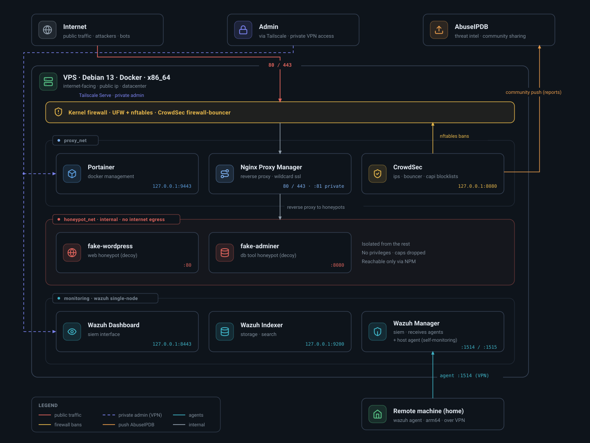

# Secure VPS Homelab
 
[](LICENSE)


 
A reproducible, security-focused homelab running on a single public VPS. This
documents a working setup built on Debian 13, using Docker for services, a
reverse proxy with wildcard HTTPS, an intrusion prevention system, a SIEM/XDR
platform, isolated web honeypots, and private admin access over a mesh VPN.
 
This is the VPS counterpart to a home-based lab. The goal is a server that is
exposed to the internet for the services that need it, while keeping every
admin interface off the public internet.
 

 
## What this is
 
A practical reference for someone who wants to run real services on a cheap
VPS without leaving the admin surface exposed. Everything here was deployed and
tested on a live server. Sections that were not finished are listed in the
roadmap rather than documented as if they work.
 
## Architecture
 
The host runs Docker. A reverse proxy is the only service with public ports
(80 and 443). Every administrative interface listens on localhost and is
published over the mesh VPN with valid TLS. An IPS watches the proxy logs and
the host, and bans hostile IPs at the firewall. A SIEM agent on the host and a
second agent on a remote home machine report to a single manager. Two web
honeypots sit in their own isolated network with no path to the rest of the
stack and no internet egress.
 
The diagram above shows the three Docker networks: proxy_net for the real
services, honeypot_net (internal, no egress) for the decoys, and the monitoring
stack. The reverse proxy is the only container that bridges the public side and
the honeypot network.
 
## Components
 
- Debian 13 (x86_64) on a public VPS
- Docker Engine with separate networks for proxied services and honeypots
- Container manager (Portainer) for day to day operations
- Reverse proxy (Nginx Proxy Manager) with a wildcard certificate
- Wildcard TLS through Let's Encrypt DNS-01 (OVH API in this setup)
- IPS (CrowdSec) with a native nftables firewall bouncer, CAPI blocklists and
  AbuseIPDB community reporting
- SIEM/XDR (Wazuh single-node) with agents on the VPS and a remote host
- Two isolated web honeypots (WordPress and Adminer) used as decoys
- Mesh VPN (Tailscale) with MagicDNS and Serve for private admin access
- Kernel network hardening (sysctl) aligned with CIS recommendations
- Automated, self-discovering backups with retention
## Security model
 
The principle is simple. The internet only ever talks to ports 80 and 443 on
the reverse proxy. Everything else is either bound to localhost and exposed
through the VPN, or filtered by the firewall.
 
- SSH uses key authentication only, root login disabled, on a non-default port
- UFW denies inbound by default
- Admin interfaces (proxy admin, container manager, SIEM dashboard) never get a
  public port. They bind to 127.0.0.1 and are served over the VPN with valid
  TLS certificates
- The IPS bans known-bad and actively hostile IPs at the firewall layer, and
  reports confirmed abuse to the community
- The SIEM gives file integrity monitoring, log analysis, CIS assessment and
  vulnerability detection on every monitored host
- The honeypots run in an internal Docker network with no egress, dropped
  capabilities and no privilege escalation, reachable only through the proxy
A note that cost real time to learn: Docker bypasses UFW. Publishing a port
with `-p 9443:9443` exposes it on all interfaces regardless of UFW rules,
because Docker writes its own nftables rules ahead of UFW. The fix used here is
explicit bind addresses. Admin ports are published as `127.0.0.1:PORT:PORT`,
public ports as `PORT:PORT`. Always check `docker ps` after starting a
container to confirm which interface each port is on.
 
## A word on the honeypots
 
The two honeypots are real applications (WordPress and Adminer), not purpose
built honeypot software. Real applications carry real vulnerabilities, so the
isolation matters more than the decoy itself. They are placed on a dedicated
honeypot_net marked internal, which removes all internet egress, and they are
not attached to the network that hosts the admin tools. A compromise of a decoy
lands an attacker in a network with nothing but the proxy in front of it, no
outbound access, and no reach into Portainer, CrowdSec or the SIEM. If you
reproduce this, keep that isolation strict and treat the decoys as expendable.
 
## Prerequisites
 
- A VPS running Debian 13 with at least 8 GB RAM for the full stack. The SIEM
  indexer alone wants well over a gigabyte
- A domain name. This setup uses a domain hosted at OVH
- A Tailscale account for the mesh VPN
- API credentials for your DNS provider, used for the wildcard certificate
## Install order
 
The order matters. Each step assumes the previous one is in place.
 
1. Harden SSH and configure the firewall
2. Point DNS at the VPS, including a wildcard record
3. Install and join the mesh VPN
4. Install Docker and the container manager
5. Deploy the reverse proxy and issue the wildcard certificate
6. Deploy the IPS and connect the firewall bouncer
7. Deploy the SIEM and enroll the agents
8. Move admin interfaces behind the VPN with valid TLS
9. Apply kernel hardening
10. Set up backups
11. Optionally, deploy the isolated honeypots
Detailed steps are in [docs/INSTALL.md](docs/INSTALL.md). Configuration files
referenced below live in `compose/`, `scripts/` and `configs/`.
 
## Repository layout
 
```
compose/      docker-compose files for the proxy, IPS, SIEM and honeypots
scripts/      backup script
configs/      sysctl hardening, IPS acquisition config
docs/         install guide, troubleshooting notes, architecture diagram
```
 
All values that are specific to a deployment are placeholders. Replace
`YOUR_DOMAIN`, `YOUR_VPS_PUBLIC_IP`, `YOUR_TAILSCALE_IP`,
`YOUR_TAILNET_NAME` and anything marked `CHANGE_ME` before use. No real
secrets are committed. Where a password hash is required, the command that
generates one is shown instead of a value.
 
## DNS provider note
 
The wildcard certificate is issued through the Let's Encrypt DNS-01 challenge.
This setup uses the OVH API because the domain is hosted there. The reverse
proxy supports other DNS-01 providers (Cloudflare, and others) through the same
challenge mechanism with provider-specific credentials. Only the OVH path was
tested here, so that is the only one documented in detail.
 
## Roadmap
 
Planned for future commits, not yet included because they are not finished and
tested:
 
- CIS-aligned SSH hardening beyond the baseline
- Off-site backup sync to a second machine over the VPN
- Binding the SIEM agent enrollment ports to the VPN interface only
## What took the most time
 
The honest list, because it is more useful than a clean walkthrough. See
[docs/TROUBLESHOOTING.md](docs/TROUBLESHOOTING.md) for detail.
 
- Understanding that Docker bypasses UFW, and fixing every exposed admin port
- A SIEM password change that desynced three components and silently broke
  indexing until a queue filled the disk
- The IPS firewall bouncer not existing as a Docker image and needing a native
  install
- The SIEM container reporting a CIS policy for the wrong distribution
- Realizing the honeypots had been placed on the same network as the admin
  tools, and isolating them properly afterward
